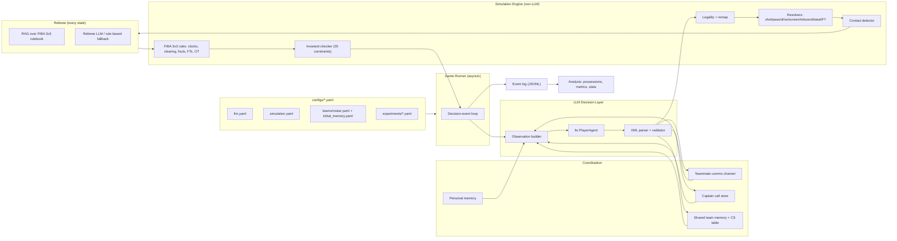
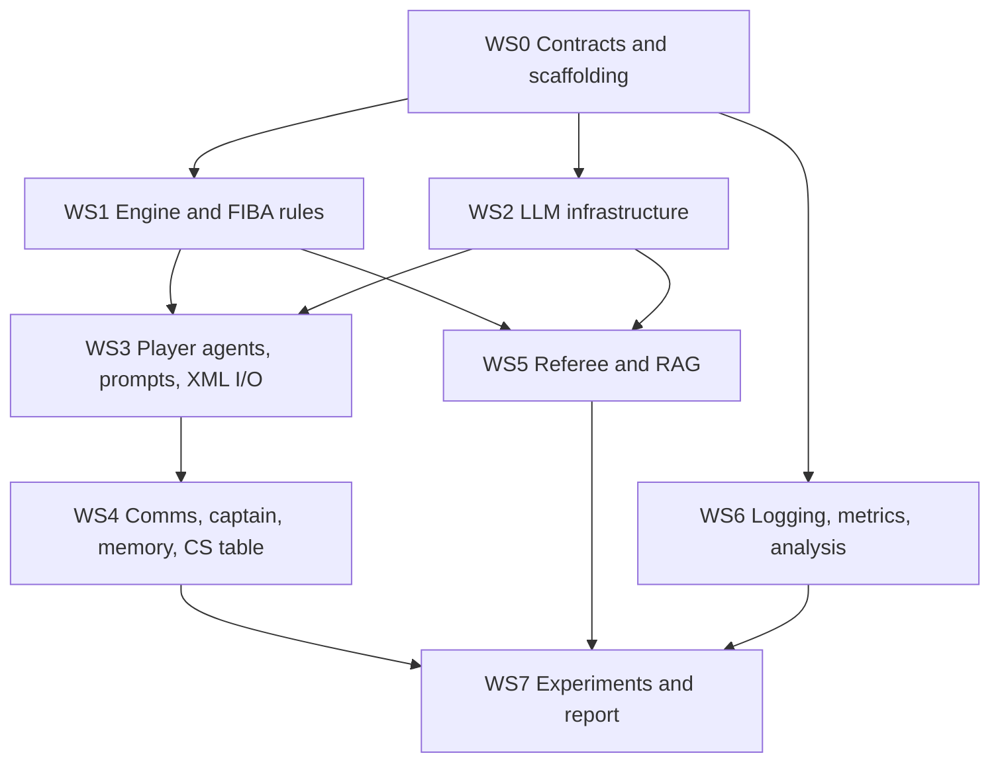

# Implementation Plan: LLM Multi-Agent 3v3 Basketball

**Group 16, DSA4213 (Semester 1, AY2026/2027).**
Source: [proposal/DSA4213 Group Project Proposal.pdf](proposal/DSA4213%20Group%20Project%20Proposal.pdf)

> [!NOTE]
> This is a planning document only. No implementation has started.

---

## 0. Confirmed Scope and Resolved Decisions

| # | Topic | Decision |
|---|---|---|
| — | LLM backend | **OpenRouter**, set in `configs/llm.yaml`. **One model config shared by all 6 player agents.** The referee has its own config block and can be built later (rule-based fallback until then). |
| — | Game format | **Full FIBA 3x3:** 10-minute clock **or** first to 21. A tie at time goes to overtime (first to score 2 points in OT). |
| — | Deliverable | **Backend only.** No UI. |
| — | Organisation | **Workstreams**, not assigned to people. |
| 1 | Referee trigger | The referee is called **on every resolved state**. It only makes a call when warranted; most states return `call="NONE"`. |
| 2 | Team B / Team C | Team B (no comms): the captain **can still issue `<c>[action]` directives** and tactic calls; non-captains send no messages. Team C (no captain): **CSSR is ignored**. The metrics that matter for A vs C are **CCAR and PPP**. |
| 3 | CS table | The counter-strategy table **starts empty for all teams**. |
| 4 | Output format | LLMs emit **XML/tag output directly**, in the proposal's notation. A config switch allows JSON output converted to XML as a fallback if a model proves unreliable. |
| 5 | Profile attributes | Add **`ball_handling`** and **`rebounding`** to the four proposal abilities. |
| 6 | Mirror control (A vs A) | **Skipped for now.** It can be added later as a config-only change. |
| 7 | Players | **You choose them** and fill them into a YAML template (`configs/teams/roster.yaml`). |
| 8 | Shot model | `P(make) = σ(β0 + β1·shooting + β2·shotquality − β3·contest − β4·fatigue)` (Section 6, WS1). |

---

## 1. Design Principles

1. **The engine is the source of truth.** LLMs only *propose* intent. Every outcome comes from the deterministic engine, using seeded randomness.
2. **The engine must run without any LLM.** Heuristic and random agents can play full games. This validates the engine (SIR = 0) at no API cost.
3. **Agree on interfaces first.** Shared schemas for state, actions, messages, memory and log records are fixed before parallel work starts.
4. **An ablation is a config flag, not a code branch.** Teams A–D differ only in `coordination: {comms, captain, memory_write}`.
5. **Log every metric's inputs.** Every metric must be computable from the JSONL event logs alone.
6. **Reproducibility.** Seeded RNG streams, pinned model and provider, config snapshots per game, and the prompt template hash in every record.

---

## 2. Architecture



### One decision event (the proposal's 10 steps, mapped to code)

```mermaid
sequenceDiagram
    participant R as Runner
    participant O as ObservationBuilder
    participant P as PlayerAgents (x6, parallel)
    participant C as Comms/Captain/Memory
    participant E as Engine
    participant F as Referee
    participant L as EventLog

    R->>O: build 6 observations (state + t-1 msgs/calls + memory)
    O->>P: prompts (async gather)
    P-->>R: XML outputs (action, messages, captain call, memory/CS proposals)
    R->>C: queue msgs/calls for t+1; validate+merge memory/CS (if write enabled)
    R->>E: legality check -> remap invalid (IAR)
    E->>E: resolve ball handler + primary defender, then off-ball
    E->>E: detect contact (annotates state)
    E->>F: resolved state (EVERY event) -> templated query -> RAG -> decision
    F-->>E: call = NONE | FOUL | VIOLATION
    E->>E: apply rules (score, FTs, possession, clocks, fatigue)
    E->>E: run 20 invariants (SIR)
    R->>L: write decision/outcome/memory/referee records
    R->>R: next decision event or end game
```

---

## 3. Tech Stack

| Concern | Choice | Notes |
|---|---|---|
| Language/env | Python 3.11+, `uv` (or `pip` + `requirements.txt`) | Lockfile so every member gets the same environment |
| Schemas | `pydantic` v2 | Internal typed models; XML is parsed into them |
| Config | `PyYAML` + Pydantic models | YAML is validated at load and fails fast, with helpful errors |
| LLM client | `openai` SDK with `base_url=https://openrouter.ai/api/v1` | Async; `tenacity` for retries |
| XML parsing | `lxml` (with `recover=True`) + regex for the inline `[action]` / `[tactic]` tags | Tolerant of minor malformation |
| Prompts | `jinja2` templates | Versioned; the template hash is logged |
| Embeddings | `sentence-transformers` (`all-MiniLM-L6-v2`), local | Memory/CS similarity and RAG |
| Vector store | NumPy cosine (FAISS optional) | The rulebook is small |
| Rulebook parsing | `pdfplumber` | Clause-level chunks |
| Analysis | `pandas`, `pyarrow`, `scipy`, `statsmodels`, `matplotlib` | |
| CLI | `typer` | `run-game`, `run-experiment`, `build-index`, `metrics`, `transcript` |
| Tests | `pytest`, `hypothesis` | Property-based tests on engine invariants |

---

## 4. Repository Layout

```
llm-3v3-basketball-agents/
├── IMPLEMENTATION_PLAN.md
├── configs/
│   ├── llm.yaml                  # OpenRouter models/params (players + referee)
│   ├── simulation.yaml           # court, clocks, time costs, resolver coefficients
│   ├── teams/
│   │   ├── roster.yaml           # YOU fill in: 3 players + captain (mirrored for both teams)
│   │   └── initial_memory.yaml   # pre-game scouting, game plan, coach instructions
│   └── experiments/
│       ├── pilot.yaml
│       ├── ablation_comms.yaml   # A vs B
│       ├── ablation_captain.yaml # A vs C
│       └── ablation_memory.yaml  # A vs D
├── data/
│   └── rules/                    # FIBA 3x3 rulebook PDF, chunks.jsonl, embeddings.npy
├── src/bball3x3/
│   ├── config.py
│   ├── schemas/                  # state.py, actions.py, messages.py, memory.py, referee.py, log.py
│   ├── engine/
│   │   ├── court.py              # grid, zones, arc, distances
│   │   ├── state.py              # GameState transitions
│   │   ├── actions.py            # action space, legality, remapping
│   │   ├── resolvers.py          # shot/pass/drive/screen/rebound/steal/FT
│   │   ├── shot_quality.py       # shotquality + contest computation
│   │   ├── contact.py            # contact detection -> ContactEvent
│   │   ├── rules.py              # FIBA 3x3: clearing, fouls, bonus, OT, end conditions
│   │   ├── clock.py              # game/shot clock, action time costs
│   │   ├── invariants.py         # 20 constraints from proposal Table 3
│   │   └── rng.py                # seeded independent RNG streams
│   ├── agents/
│   │   ├── base.py               # Agent protocol: decide(obs) -> AgentOutput
│   │   ├── llm_player.py
│   │   ├── heuristic_player.py   # non-LLM baseline for engine validation
│   │   ├── random_player.py      # fuzzing
│   │   ├── observation.py        # GameState -> per-agent observation (Code 1 format)
│   │   ├── xml_io.py             # XML parse/render (+ JSON->XML fallback)
│   │   └── prompts/              # system.j2, player.j2, captain_addendum.j2, referee.j2
│   ├── coordination/
│   │   ├── comms.py              # per-team message channel (t -> t+1)
│   │   └── captain.py            # current tactical call store
│   ├── memory/
│   │   ├── personal.py           # bounded per-player recent events (templated, no LLM)
│   │   ├── shared.py             # per-opponent tendency store, write validation, merge
│   │   ├── cs_table.py           # counter-strategy lookup (starts empty)
│   │   └── similarity.py
│   ├── referee/
│   │   ├── index_builder.py      # offline chunk + embed + category label
│   │   ├── query.py              # deterministic templated query from referee state
│   │   ├── retriever.py          # category filter + top-3
│   │   ├── llm_referee.py
│   │   └── rule_referee.py       # fallback until the LLM referee is ready
│   ├── llm/
│   │   ├── client.py             # OpenRouter async client, retries
│   │   ├── cache.py              # SQLite cache (debug/pilot)
│   │   └── budget.py             # token/cost accounting, hard stop
│   ├── logging/event_log.py
│   ├── runner/
│   │   ├── game.py               # decision-event loop
│   │   ├── experiment.py         # matchups x seeds, resumable, concurrent games
│   │   └── cli.py
│   └── analysis/
│       ├── possessions.py
│       ├── metrics.py            # PPP, MAAR, CCAR, CSSR, MAUR, IAR, SIR (+ extras)
│       ├── stats.py
│       └── qualitative.py        # possession transcripts for manual review
├── tests/
├── notebooks/
└── runs/                         # gitignored: runs/<exp_id>/<game_id>/...
```

---

## 5. Configuration Files

### 5.1 `configs/llm.yaml`

```yaml
provider:
  base_url: https://openrouter.ai/api/v1
  api_key_env: OPENROUTER_API_KEY        # read from env / .env, never committed
  app_name: dsa4213-3x3-agents
  routing:
    order: []                            # optionally pin a provider, e.g. ["OpenAI"]
    allow_fallbacks: false               # keep the same backend across all conditions

players:                                 # SAME config for all 6 player agents, all conditions
  model: <openrouter-model-slug>         # chosen after pilot
  temperature: 0.7
  top_p: 1.0
  max_tokens: 500
  seed: null
  output_format: xml                     # xml (default) | json (converted to XML internally)
  include_rationale: true                # short <RATIONALE> for qualitative review
  timeout_s: 45
  max_retries: 3
  repair_attempts: 1                     # one re-ask on malformed output, then safe default

referee:
  enabled: false                         # false -> rule-based referee (still runs every state)
  backend: llm                           # llm | rule_based
  model: <openrouter-model-slug>
  temperature: 0.0
  max_tokens: 200
  output_format: xml
  top_k_rules: 3

embeddings:
  backend: local
  model: sentence-transformers/all-MiniLM-L6-v2

runtime:
  max_concurrent_requests: 12
  cache: { enabled: true, path: .cache/llm_cache.sqlite }  # disable for main experiments
  budget: { max_usd_per_experiment: 25.0 }
```

### 5.2 `configs/teams/roster.yaml` (template for you to fill in)

```yaml
# Fill in your chosen players. Both teams use this SAME roster (mirrored: A1-A3 vs B1-B3).
# All ability ratings are integers 1-10. Leave nothing blank; the loader rejects empty fields.
source_note: ""                 # e.g. "FIBA 3x3 public profiles, retrieved <date>"
captain: P1                     # slot of the captain (same slot on both teams)

players:
  - slot: P1
    name: ""
    source_url: ""              # FIBA 3x3 profile / stats page
    abilities:
      shooting: null
      passing: null
      defense: null
      stamina: null
      ball_handling: null       # added field
      rebounding: null          # added field
    playstyle: ""               # natural-language tendencies from the coach
    synthetic_fields: []        # list any field NOT taken from public data, e.g. [playstyle]

  - slot: P2
    # ...same structure...

  - slot: P3
    # ...same structure...
```

How the abilities are used. The LLM sees them as `Shooting: 7/10, ...`.

| Ability | Engine usage |
|---|---|
| `shooting` | Shot model (β1), free throws |
| `passing` | Pass completion |
| `defense` | Contest strength, drive stopping, steals, lane interception |
| `stamina` | Fatigue accumulation and recovery rate |
| `ball_handling` | Drive success, resistance to strips and reach-in steals, dribble turnovers |
| `rebounding` | Weight in the rebound lottery, box-out effectiveness |

### 5.3 `configs/teams/initial_memory.yaml` (template)

```yaml
# Initial shared team memory (identical content for both teams, IDs mirrored onto the opponent).
game_plan: ""                   # e.g. "Attack switches, keep spacing in corners"
coach_instructions: ""
opponent_scouting:              # becomes initial memory entries (confidence 1, observed_by: PREGAME)
  - opponent_slot: P1
    category: defensive_tendency
    tendency: ""
# The counter-strategy (CS) table is NOT configured here: it always starts empty.
```

### 5.4 `configs/simulation.yaml` (excerpt)

```yaml
court:
  width_m: 15
  depth_m: 11
  cell_m: 1.0                    # 15x11 grid (matches proposal coords like (4,6))
  basket: [7, 1]
  arc_radius_m: 6.75             # 2-pt line in 3x3
rules:
  game_length_s: 600
  win_score: 21
  shot_clock_s: 12
  overtime_points_to_win: 2
  team_foul_bonus: { two_fts_from: 7, two_fts_plus_possession_from: 10 }
time_costs_s: { PASS: 1, SHOOT: 1, DRIVE: 2, DRIBBLE_MOVE: 2, POST_UP: 2, HOLD: 1, CLEAR: 2 }
movement: { max_cells_per_s: { SLOW: 1, MEDIUM: 2, FAST: 3 }, fatigue_speed_penalty: 0.05 }

shot_model:                      # P(make) = σ(β0 + β1·shooting + β2·shotquality − β3·contest − β4·fatigue)
  beta0: -1.6
  beta1: 0.25                    # shooting on 1-10 scale
  beta2: 2.0                     # shotquality in [0,1]
  beta3: 1.5                     # contest in [0,1]
  beta4: 0.08                    # fatigue on 0-10 scale
  shotquality_weights: { location: 0.6, shot_type: 0.25, screen_advantage: 0.15 }
  location_score: { RIM: 1.0, SHORT: 0.7, MID: 0.45, ARC2: 0.3, DEEP2: 0.15 }
  shot_type_score: { LAYUP_OFF_DRIVE: 0.9, CATCH_AND_SHOOT: 0.8, POST: 0.6, OFF_DRIBBLE: 0.5, FORCED_LATE_CLOCK: 0.2 }
contest_model: { max_dist_cells: 3, b_defense: 0.06, contest_action_bonus: 0.2, help_bonus: 0.15 }
pass_model:    { base: 2.5, b_passing: 0.2, b_distance: -0.15, b_lane_defender: -1.5, b_def_intercept: 0.1 }
drive_model:   { base: 0.0, b_ball_handling: 0.3, b_defense: -0.3, b_help: -0.8 }
rebound:       { off_base_prob: 0.28, b_rebounding: 0.15, b_boxout: -0.6, b_proximity: 0.4 }
contact:       { drive_contest_prob: 0.25, screen_prob: 0.15, rebound_prob: 0.10, reach_prob: 0.2 }
fatigue:       { per_s_active: 0.05, per_s_sprint: 0.12, stamina_scale: 0.08, recover_dead_ball: 0.3, max: 10 }
```

All coefficients are placeholders. They are calibrated in Phase 1 and kept explicit for sensitivity analysis.

### 5.5 `configs/experiments/ablation_comms.yaml` (shape shared by all three)

```yaml
experiment_id: abl_comms_v1
matchup:
  home: { label: A_full,    coordination: { comms: true,  captain: true,  memory_write: true } }
  away: { label: B_no_comm, coordination: { comms: false, captain: true,  memory_write: true } }
seeds: [101, 102, 103, 104, 105, 106, 107, 108, 109, 110]
swap_first_possession: true     # each seed played twice so each team starts with the ball once
max_concurrent_games: 4
```

The other two files differ only in the away team:

| File | Away team | `coordination` |
|---|---|---|
| `ablation_captain.yaml` | `C_no_captain` | `{comms: true, captain: false, memory_write: true}` |
| `ablation_memory.yaml` | `D_read_only` | `{comms: true, captain: true, memory_write: false}` |

---

## 6. Workstreams

**WS0 blocks everything.** Once it is done, the other workstreams can run in parallel.



---

### WS0 — Contracts and Scaffolding (blocking)

**Deliverables**
- Repo skeleton, `pyproject.toml`, `ruff`, `pytest`, and GitHub Actions CI.
- Internal Pydantic models for everything that crosses a module boundary:

```python
class Abilities(BaseModel):
    shooting: int; passing: int; defense: int; stamina: int
    ball_handling: int; rebounding: int          # each 1..10

class PlayerState(BaseModel):
    id: str; team: Literal["A","B"]; pos: tuple[int,int]; prev_pos: tuple[int,int]
    movement: MovementLabel; speed: Speed; has_ball: bool; fatigue: float  # 0..10

class BallState(BaseModel):
    status: Literal["HELD","IN_PASS","IN_SHOT","LOOSE","DEAD"]
    pos: tuple[int,int]; holder: str | None

class GameState(BaseModel):
    event_idx: int; game_clock_s: float; shot_clock_s: float
    score: dict[str,int]; team_fouls: dict[str,int]
    offense: Literal["A","B"]; needs_clear: bool; phase: Phase  # LIVE / DEAD / FT / OT
    players: dict[str, PlayerState]; ball: BallState
    matchups: dict[str, str]                   # defender -> offensive player

class Directive(BaseModel):                    # parsed from [action to=.. act=.. target=..]
    to: str; act: ActionType; target: str | None

class Message(BaseModel):
    sender: str; is_captain_channel: bool
    kind: Literal["action","tactic","info"]
    text: str; directive: Directive | None = None; cs: str | None = None

class CaptainCall(BaseModel):
    maintain: bool; tactic: Message | None; directives: list[Message] = []

class MemoryProposal(BaseModel):
    opponent: str; category: MemoryCategory; tendency: str

class CSProposal(BaseModel):
    opponent_strategy: str; counter_strategy: str; side: Literal["offense","defense"]

class AgentOutput(BaseModel):
    action: ActionType; target: str | None; memory_ref: list[str] | None
    messages: list[Message] = []; captain_call: CaptainCall | None = None
    memory_update: MemoryProposal | None = None; cs_update: CSProposal | None = None
    rationale: str | None = None
    raw_text: str; parse_ok: bool; parse_errors: list[str] = []

class RefereeDecision(BaseModel):
    call: Literal["NONE","FOUL","VIOLATION"]
    offender: str | None; fouled_player: str | None
    foul_type: FoulType | None; violation_type: JudgementViolation | None
    rule_ids_cited: list[str] = []
```

- An event-log record schema (WS6) and a `CoordinationConfig`.

**Done when:** every workstream can import the schemas and develop against stubs.

---

### WS1 — Simulation Engine and FIBA 3x3 Rules

**1. Court.** A 15×11 grid at 1 m per cell. The arc test uses 6.75 m Euclidean distance from the rim. Named zones map to cells, so agents can use them as targets: `TOP, LEFT_WING, RIGHT_WING, LEFT_CORNER, RIGHT_CORNER, LEFT_ELBOW, RIGHT_ELBOW, LEFT_BLOCK, RIGHT_BLOCK, PAINT`.

**2. Action space.**

| Role | Actions | Target |
|---|---|---|
| Ball handler | `SHOOT`, `PASS`, `DRIVE`, `DRIBBLE_MOVE`, `POST_UP`, `HOLD` | teammate / zone / direction |
| Offense off-ball | `CUT`, `CUT_BASELINE`, `SCREEN`, `ROLL`, `POP`, `SPOT_UP`, `MOVE`, `HOLD` | zone / defender |
| Defense | `DEFEND`, `HELP_PAINT`, `SWITCH`, `DOUBLE_TEAM`, `CONTEST`, `STEAL_ATTEMPT`, `DENY`, `HOLD` | offensive player / zone |
| Rebound phase | `CRASH_BOARDS`, `BOX_OUT`, `GET_BACK` | player / none |

`legal_actions(state, pid)` produces the `[LEGAL ACTIONS]` list shown in each prompt. IAR is still measured, because agents can ignore the list.

**3. Legality and remapping.** Each proposal is checked against constraints 7, 8, 9 and 20: possession, reachability, movement limit and dead ball. Invalid proposals become safe defaults:
- ball handler → `HOLD`, or a safe pass if the shot clock is ≤ 2
- off-ball offense → `SPOT_UP` at the nearest open zone
- defender → `DEFEND` their assigned matchup

Each remap is logged with `invalid_reason ∈ {PARSE_FAIL, UNKNOWN_ACTION, ILLEGAL_POSSESSION, INFEASIBLE, BAD_TARGET}`.

**4. Resolution order.** This follows proposal step 5:
1. Ball handler against the primary defender.
2. Screens.
3. Off-ball movement.
4. Help and rotation.
5. Contact detection.
6. Referee (every state).
7. Rules.
8. Fatigue.
9. Invariants.

**5. Shot resolver.** This is your equation:

$$P(\text{make}) = \sigma(\beta_0 + \beta_1\cdot\text{shooting} + \beta_2\cdot\text{shotquality} - \beta_3\cdot\text{contest} - \beta_4\cdot\text{fatigue})$$

| Term | Definition | Range |
|---|---|---|
| `shooting` | Shooter's rating | 1–10 |
| `shotquality` | `w_loc·location_score(distance zone) + w_type·shot_type_score + w_scr·screen_advantage` | [0, 1] |
| `contest` | `max(0, 1 − d/max_dist)` from the nearest defender, × `(1 + b_def·(defense−5))`, + bonus if the defender chose `CONTEST`, + bonus for help defense. Clipped. | [0, 1] |
| `fatigue` | Shooter's current fatigue | 0–10 |

- β3 and β4 are stored as **positive** numbers, so the minus signs in the equation apply.
- `shot_type` is inferred by the engine from context: a layup after a successful drive, catch-and-shoot right after a pass reception, post-up, off-dribble, or a forced shot when the shot clock is ≤ 2.
- `screen_advantage` = 1 if a screen freed the shooter in the previous event.
- Shots inside the arc are worth **1 point**. Shots beyond it are worth **2 points**.
- Every shot logs all the terms and the final probability, for transparency and sensitivity analysis.

**6. Other resolvers.** All use explicit coefficients.
- **Pass:** passing rating, distance, and defenders in the passing lane (point-to-segment distance) weighted by their defense rating. A failure is a steal if a defender is in the lane, otherwise an out-of-bounds turnover.
- **Drive:** `ball_handling` against `defense`, minus a help penalty. Success advances toward the rim and leads to `LAYUP_OFF_DRIVE`. Failure means being stopped, a possible charge contact, or a strip.
- **Screen:** if the screener reaches the defender's path, separation goes up next event and `screen_advantage` is flagged.
- **Rebound:** a weighted lottery on proximity, `rebounding`, `BOX_OUT`, `CRASH_BOARDS` and stamina.
- **Steal attempt:** defense against ball_handling. Carries a contact risk.
- **Free throw:** based on `shooting`, with a fatigue penalty.

**7. FIBA 3x3 rules.**
- **Shot clock:** 12 s, reset on a change of possession and on a rim-touch offensive rebound (simplified to a reset to 12).
- **Clearing rule:** after a defensive rebound or steal, the ball must be taken behind the arc before a shot (`needs_clear`). After a made basket, the defending team restarts under the basket and must clear. Clearing is automatic and costs `CLEAR` time.
- **Check-ball** at the top after dead balls.
- **Team fouls:**
  - 7th–9th: 2 FTs
  - 10th and later: 2 FTs plus possession
  - Shooting foul: 1 FT inside the arc, 2 FTs beyond it
  - And-one: 1 FT
- **End conditions:** 600 s elapsed, or either team reaching 21 or more. A tie at time goes to overtime, which ends when a team has scored 2 points in overtime.
- **First possession:** from a seeded coin flip, or alternated when `swap_first_possession: true`.

**8. Clock.** The duration of each event is the time cost of the ball handler's action. When the shot clock is ≤ 3 s, an extra decision event is forced, and agents see a `SHOT_CLOCK_LOW` flag.

**9. Movement labels.** `prev_pos` is stored so the observation builder can derive the direction and speed labels in Code 1, such as `CUTTING_LEFT`, `TOWARDS_A1` or `FAST`.

**10. Invariants.** All 20 constraints from Table 3 are implemented as `check_*(prev, new, event)`.
- In development and tests, any violation raises an error.
- In experiments, violations are logged (SIR) and the run continues.

**11. Seeded RNG streams.** Use `numpy.random.SeedSequence(seed).spawn()` to make one stream per resolver type: shot, pass, drive, rebound, contact, FT and coin flip. Matched seeds then give common random numbers across conditions.

**12. Agents without an LLM.**
- `HeuristicPlayer`: shoots when open, passes to the open teammate, defends the matchup.
- `RandomPlayer`: picks uniformly from legal actions. Used for fuzzing.

**Tests**
- Resolver and rule unit tests.
- `hypothesis` fuzz test: 1,000 random-agent games give zero invariant violations.
- Calibration: heuristic-vs-heuristic FG% (1-pt and 2-pt), PPP and possessions per game should land in a plausible range against public FIBA 3x3 stats.

**Done when:** `bball run-game --agents heuristic` completes a full game, including overtime and the 21-point end, with a valid log and SIR = 0.

---

### WS2 — LLM Infrastructure (OpenRouter)

- `LLMClient.complete(messages, cfg) -> (raw_text, usage)`.
  - Uses the async OpenAI SDK pointed at OpenRouter.
  - Sends provider routing from YAML and the `X-Title` header.
  - Records usage and cost.
- **Retries:** `tenacity` exponential backoff on 429, 5xx and timeouts. A global `asyncio.Semaphore` limits concurrency.
- **Output modes:**
  - `output_format: xml` (default): the raw text goes to the XML parser in WS3.
  - `output_format: json`: the request uses `response_format` with a JSON schema mirroring the XML. The response is converted into the same internal `AgentOutput` and rendered as XML for logs and teammates.
  - Downstream code is identical in both modes.
- **Repair:** if parsing or validation fails, send one re-ask containing the parser errors. If that fails too, the output counts as `PARSE_FAIL`, the engine remaps the action, and it counts toward IAR.
- **Cache:** SQLite keyed by a hash of the request. Turn it **on** for debugging and pilots and **off** for the main experiments (temperature > 0).
- **Budget:** cumulative cost tracking, with a hard stop at `max_usd_per_experiment`.
- **`FakeLLM`:** emits scripted or heuristic XML, so CI and integration tests need no API key.

**Done when:** six parallel calls return parsed `AgentOutput`s, with retries, cost logging and caching all verified.

---

### WS3 — Player Agents, Prompts and Direct XML I/O

**Prompt structure.** Jinja templates, with static content first so provider prompt caching can apply.
1. **System (static):** the agent's role, a 3x3 rules summary, action semantics, tag conventions, and the exact XML output contract with one example.
2. **Profile:** Code 2 `[PLAYER PROFILE]`, with all six abilities and the playstyle.
3. **Captain addendum:** included only if `captain=true` and the player is the captain.
4. **Observation:** the Code 1 format. It contains:
   - own state, teammates, opponents, matchups, ball and game
   - `[LEGAL ACTIONS]`
   - `[PREVIOUS CAPTAIN CALL]`, if `captain`
   - `[PREVIOUS TEAMMATE MESSAGES]`, if `comms`; captain directives still appear for Team B
   - `[PERSONAL MEMORY]`
   - `[SHARED TEAM MEMORY]` with IDs
   - `[COUNTER-STRATEGY TABLE]` with keys, shown as "empty" at the start
5. **Instruction:** Code 2 `[INSTRUCTION]`.

**XML output contract.** The player emits this directly, keeping the proposal's notation. Closing tags are standardised to `[/tactic]` and `[/action]`.

```xml
<RESPONSE>
  <ACTION type="PASS" target="A2" memory_ref="M03"/>
  <MESSAGES>
    <A1>[action to=A3 act=SCREEN target=B1] set a screen on B1 for me [/action]</A1>
    <A1>[tactic cs=None] let's run pick and pop on the left [/tactic]</A1>
    <A1>B1 keeps gambling on steals</A1>
  </MESSAGES>
  <CAPTAIN_CALL maintain="false">                       <!-- captain only -->
    <A1><c>[tactic cs=None] pick and roll on the left wing, A2 handles [/tactic]</c></A1>
    <A1><c>[action to=A3 act=SCREEN target=B2] screen for A2 [/action]</c></A1>
  </CAPTAIN_CALL>
  <MEMORY_UPDATE opponent="B1" category="defensive_tendency"
                 tendency="leaves passing lanes open on contested drives"/>
  <CS_UPDATE side="offense" opponent_strategy="B switches every screen"
             counter_strategy="slip the screen and cut to the rim"/>
  <RATIONALE>B1 is overplaying; A2 is open on the cut.</RATIONALE>
</RESPONSE>
```

- **`[action ...]` attributes** (`to`, `act`, `target`) are the one addition to the proposal's notation. They make MAAR and CCAR computable deterministically. The free text stays for readability.
- **Optional elements:** `MESSAGES`, `CAPTAIN_CALL`, `MEMORY_UPDATE`, `CS_UPDATE` and `RATIONALE`. `memory_ref` defaults to `None`.
- **Teammate view:** teammates see messages exactly as rendered in Code 1, for example `<A2>[action to=A3 act=SCREEN target=A2] ... [/action]</A2>`.

**Parser (`xml_io.py`)**
1. Extract the first `<RESPONSE>…</RESPONSE>` block, tolerating surrounding prose or code fences.
2. Escape stray `&` and `<` inside text nodes, then parse with `lxml` using `recover=True`.
3. Parse the inline `[action …]…[/action]` and `[tactic cs=…]…[/tactic]` with regex. Accept the unclosed `[tactic]` variant seen in the proposal.
4. Validate enums and IDs. Record `parse_errors`.
5. Any field not permitted by the team's flags (comms, captain, write) is stripped and logged as `suppressed`.

**Ablation effect on prompts.** The output contract is the same in every condition.

| Flag off | Prompt change | Runner behaviour |
|---|---|---|
| `comms` (Team B) | The teammate-messages section is shown as `none`, and non-captains get no messaging instructions | Non-captain `<MESSAGES>` dropped; **captain `<CAPTAIN_CALL>` (tactic and directives) still delivered** |
| `captain` (Team C) | No captain addendum; the captain-call section is shown as `none` | `<CAPTAIN_CALL>` ignored; `[tactic]` messages stay ordinary messages (CSSR not evaluated for C) |
| `memory_write` (Team D) | The update instruction is removed | `MEMORY_UPDATE` / `CS_UPDATE` parsed, logged, discarded; read access to initial memory only |

Disabled sections are shown as `none` rather than removed, which reduces confounding from prompt length.

**Defense.** The same templates with defensive legal actions. Defenders also message, and captains also call on defense.

**Personal memory.** The last ~8 events relevant to the player, generated from the event log with templates. **No LLM call.**

**Prompt harness.** About 20 fixed scenarios, reporting the parse success rate, IAR, directive usage and memory-ref usage for each prompt version. The template hash is logged in every decision.

**Done when:** LLM-vs-LLM games run end to end, with a parse failure rate < 2% and IAR < 5% (targets confirmed in the pilot). If the chosen model can't reach these with XML, set `output_format: json`.

---

### WS4 — Communication, Captain, Shared Memory and CS Table

**Comms channel (per team)**
- `post(t, msgs)` stores messages. `deliver(t+1)` returns the messages from event t.
- Window: the last 2 events, at most 6 messages, 200 characters each.
- Opponents never see these messages; a unit test checks this.
- Team B: only the captain channel posts.

**Captain store (per team)**
- Holds `current_call`. `maintain="true"` keeps it; a new call replaces it from t+1.
- Non-captain `[tactic]` messages reach the captain's next observation as "tactic suggestions".
- Disabled for Team C.

**Shared team memory (per team)**
- Entry fields: `id (M01…), opponent, category, tendency, confidence, observed_by, decision_event`.
- **Init:** from `initial_memory.yaml`. Entries start with confidence 1 and `observed_by: PREGAME`.
- **Write path:**
  1. Check the schema.
  2. Check that the opponent is an active opposing player.
  3. Check that the category is in the enum.
  4. Embed the tendency and compare by cosine similarity against entries with the same opponent and category.
  5. If similarity ≥ τ (default 0.80, tuned on ~50 hand-labelled pairs), do `confidence += 1` and update `decision_event`. Otherwise create a new entry.
- **Bounded:** at most 4 entries per opponent per category. On overflow, evict the lowest confidence, oldest first.
- **Read path:** all entries, rendered in natural language with IDs.
- **`memory_ref` validation:** an unknown ID counts as an invalid reference. It is logged and excluded from MAUR.
- Reset after every game.

**Counter-strategy (CS) table (per team, inside shared memory)**
- **Starts empty for all teams.**
- Entry fields: `key (01…), side, opponent_strategy, counter_strategy, created_by, decision_event, times_referenced`.
- Writes use the same validation and similarity merge (keyed on `opponent_strategy`).
- A `[tactic cs=XX]` reference is validated against the table *as it was at that event*.
- Team D cannot write, so its table stays empty and its CSSR is 0 by construction. For A vs D, CSSR is therefore an adaptation signal **within Team A** (growth over the game), while PPP and MAUR carry the comparison.

**Done when:** each flag changes exactly one information flow, verified by unit tests per flag.

---

### WS5 — Referee Agent and RAG (runs every state; LLM version deferrable)

**Interface.** `Referee.judge(referee_state) -> RefereeDecision` is called after **every** resolved decision event.
- Most states return `call="NONE"`.
- The referee handles **judgement-dependent** fouls and violations only.
- Objective violations (shot clock, out of bounds, clock expiry, clearing) stay in the engine. Any referee output claiming one is rejected and logged.

**Referee state.** The Code 3 format, produced for every event:
- game block, all players with previous and current positions, matchups, ball
- `[CURRENT EVENT]`
- `[CONTACT EVENT]`: `Contact Detected: true/false`, plus contact fields when true

The engine's contact detector only *annotates* the state. The referee still sees and judges every state.

**Call types.**
- `FOUL` with `foul_type ∈ {DEFENSIVE_FOUL, OFFENSIVE_FOUL (charge / moving screen / push-off), SHOOTING_FOUL, LOOSE_BALL_FOUL, UNSPORTSMANLIKE, TECHNICAL}`.
- `VIOLATION` with `violation_type` from a small set of judgement-based violations the engine can represent: `GOALTENDING`, `BASKET_INTERFERENCE`, `STALLING`. The list can be extended later.

**Phase A — `RuleBasedReferee` (now).** Simple probabilistic rules over the same state. Used while `referee.enabled: false`, and also runs every state.

**Phase B — `LLMReferee` with RAG**
1. **Offline index (`bball build-index`):**
   - Parse the official FIBA 3x3 rulebook into clause-level chunks.
   - Assign each chunk a category: `personal_contact, blocking_charging, screening, shooting_foul, illegal_use_of_hands, loose_ball, unsportsmanlike, technical, goaltending_interference, stalling, free_throws, team_fouls`.
   - Embed the chunks and save `chunks.jsonl` and `embeddings.npy`.
   - Built once and shared by all conditions.
2. **Deterministic query (every state):** a fixed template over event and contact fields. For example: `"{event_type}; contact={detected}; {contact_type} between {off} ({off_move}, has_ball={hb}) and {def} ({def_move}) at {loc}; shot_in_air={...}"`. The same state always gives the same query.
3. **Retrieval:** a rule-based category filter keyed on `event_type`, `contact_type` and ball status, then the top 3 chunks by cosine similarity.
4. **Decision:** the LLM runs at temperature 0. Input is the referee state plus the 3 retrieved excerpts. Output is XML in the proposal's notation:

```xml
<REFEREE_DECISION call="FOUL" foul="TRUE" offender="B1" fouled_player="A1"
                  foul_type="DEFENSIVE_FOUL" violation_type="NONE" rules="R12.3,R12.5"/>
<REFEREE_DECISION call="NONE" foul="FALSE" offender="NONE" fouled_player="NONE"
                  foul_type="NONE" violation_type="NONE" rules=""/>
```

5. A malformed referee output becomes `call="NONE"` and is logged as `REF_PARSE_FAIL`.
6. A logged call is fed back into the state, so players see it at the next event.

**Validation**
- About 40 hand-written states with expected calls: 30 contact and 10 no-contact.
- Measures: accuracy, false-call rate on no-contact states, and retrieval hit rate in the top 3.

---

### WS6 — Event Logging, Metrics and Analysis

**Event log (one JSONL file per game), record types**

| Type | Key fields |
|---|---|
| `game_start` | game_id, seed, matchup, coordination flags, config hash, prompt hashes, model slug, roster |
| `decision` | event_idx, player, observation hash, raw output, parsed output, parse_ok, invalid_reason, remapped_action, memory_ref, latency, tokens, cost |
| `message` | event_idx, sender, team, channel (teammate/captain), kind, text, directive, cs, delivered_at, suppressed |
| `captain_call` | event_idx, team, maintain, tactic, cs, directives |
| `memory_proposal` / `memory_write` | proposal, accepted, merged_into / new_id, similarity, confidence_after |
| `cs_proposal` / `cs_write` | key, opponent_strategy, counter_strategy, merged |
| `resolution` | per-action outcome, all model terms (e.g. shooting, shotquality, contest, fatigue, p_make), RNG draws |
| `referee` | event_idx, query, retrieved chunk IDs, decision, latency, cost |
| `state` | GameState snapshot after the transition |
| `invariant_violation` | constraint id, details |
| `possession_end` | team, points, end_reason, start/end event_idx |
| `game_end` | final score, OT flag, totals, total cost |

**Possessions.** A possession starts when a team gains control and ends when the opponent does. An offensive rebound does **not** start a new possession. Free throws count in the possession where the foul occurred.

**Metric definitions**

| Metric | Rule |
|---|---|
| **PPP** | Points ÷ possessions, per team per game |
| **MAAR** | Among decisions at t+1 by a player addressed by a teammate `[action to=…]` directive received at t: the share where `act` matches and the target matches (target ignored if none). Window k = 1, with k = 2 as a robustness check |
| **CCAR** | Same as MAAR, for captain `<c>[action …]` directives |
| **CSSR** | `[tactic]` calls/messages with a valid `cs` key ÷ all `[tactic]` calls/messages |
| **MAUR** | Decisions with ≥ 1 valid `memory_ref` ÷ all decisions. Also report **grounded MAUR**: the referenced opponent is involved in the action |
| **IAR** | Invalid proposals ÷ all proposals, broken down by reason |
| **SIR** | Transitions with ≥ 1 invariant violation ÷ all transitions, broken down by constraint |

**Which metrics apply to each comparison**

| Comparison | Primary | Notes |
|---|---|---|
| A vs B (comms) | PPP, MAAR | MAAR exists only for A (B has no teammate messages). CCAR is reported for both as context, since B's captain still directs |
| A vs C (captain) | **PPP, CCAR** | CCAR exists only for A. CSSR is not evaluated for C |
| A vs D (memory updates) | PPP, MAUR, CSSR | D's MAUR uses initial memory only. D's CSSR is 0 by construction, so A's CSSR and MAUR over time show adaptation |
| All | IAR, SIR, referee call rate | System validity |

**Extra descriptive metrics.** Assist rate, turnover rate, screen → shot conversion, coordination conflicts (teammates targeting the same zone), memory growth over time, and adaptation curves (PPP, MAUR, CSSR by game-time quintile).

**Statistics (`stats.py`)**
- Paired by seed, with the game as the unit of analysis.
- Per-seed difference (A − X), with a cluster bootstrap 95% CI and a Wilcoxon signed-rank test.
- Possession-level model: `points ~ condition + score_diff + time_bin + (1 | game)`.
- Adaptation: condition × time-bin interaction.
- Stability (success criterion 5): sign agreement of per-seed effects.

**Qualitative tools.** `bball transcript <game> <possession>` prints a readable transcript of observations, messages, calls, actions, rationales, memory references, referee calls and outcomes. This supports the Phase 3 manual review.

---

### WS7 — Experiments and Reporting

**Phase 1: System validation (not included in results)**
1. Heuristic vs heuristic: 1,000 games for SIR = 0 and resolver calibration.
2. LLM pilot: 3–5 games, to measure parse rate, IAR, events per game, tokens per call, cost, wall-clock time and referee call rate. **Decide XML vs JSON mode here.**
3. Tune prompts, the similarity threshold τ, and the message window.
4. **Freeze** prompts and configs. The commit hash is recorded in every run.

**Phase 2: Main ablations.** Run `ablation_comms`, `ablation_captain` and `ablation_memory`. Each uses N seeds × 2 (swapped first possession). The target is N = 10, adjusted after the pilot. If the budget gets tight, cut seeds before cutting conditions.

**Phase 3: Robustness and qualitative review**
- Seed-stability analysis.
- Coefficient sensitivity sweep: shot-model β values and contact probabilities ±20%, on a subset of seeds.
- Manual review of about 10 possessions per comparison, covering both success and failure.

**Report outputs**
- Metric tables and adaptation curves.
- Directive → action examples.
- A memory-driven adaptation case study.
- A limitations section: sim-to-real gap, model dependence, and the referee backend used.

---

## 7. Core Loop (pseudocode)

```python
async def play_game(cfg, seed, teams, agents, referee, log):
    state = rules.init_state(cfg, rng.first_possession(seed))
    while not rules.game_over(state):
        obs = {pid: observation.build(state, pid, comms, captain, pmem, smem, teams)
               for pid in state.players}
        outputs = await asyncio.gather(*(agents[pid].decide(obs[pid]) for pid in obs))

        for pid, out in zip(obs, outputs):
            t, flags = team_of(pid), teams[team_of(pid)].coordination
            log.decision(state, pid, out)
            if flags.comms:
                comms[t].post(state.event_idx, out.messages)
            if flags.captain and pid == captain_of(t):
                captain[t].update(out.captain_call, state.event_idx)
            smem[t].propose(out.memory_update, out.cs_update,
                            write_enabled=flags.memory_write, event=state.event_idx)

        actions = engine.legalize(state, outputs, log)              # IAR + remap
        result  = engine.resolve(state, actions, rng)               # priority order + contact annotation
        decision = await referee.judge(build_referee_state(state, result))  # EVERY state
        result.apply_referee(decision, log)
        new_state = rules.apply(state, result)                      # score, FTs, clocks, possession, fatigue
        invariants.check(state, new_state, result, log)             # SIR
        pmem.update(new_state, result)
        log.state(new_state)
        state = new_state
    log.game_end(state)
```

---

## 8. Cost and Runtime Estimate (replace with Phase 1 numbers)

These are rough assumptions:
- about 70 possessions per game across both teams, about 4 decision events per possession, so ~280 events
- 6 player calls per event, at ~2,000 input and ~250 output tokens each
- 1 referee call per event, at ~2,500 input and ~150 output tokens

| Quantity | Estimate |
|---|---|
| Player calls per game | ~1,700 |
| Referee calls per game (every state) | ~280 |
| Tokens per game | ~4.1M in / ~0.5M out |
| Cost per game, cheap model (~$0.15/M in, $0.60/M out) | ~$0.95 |
| Cost per game, mid-tier model (~$1/M in, $4/M out) | ~$6 |
| Wall-clock per game (6 parallel player calls, then 1 serial referee call per event) | ~20–35 min |
| Full study: 3 ablations × 10 seeds × 2 = 60 games | ~$57 cheap / ~$360 mid-tier |

> [!TIP]
> The referee call is on the critical path of every event. Using a fast, cheap model for the referee, and keeping retrieved excerpts short, matters more for wall-clock time than for cost. Running 4–8 games concurrently hides most of the latency.

---

## 9. Testing Strategy

| Level | What |
|---|---|
| Unit | Shot model terms, other resolvers, FIBA rules (clearing, bonus, OT, 21-point end), legality, XML parser (valid, malformed, unclosed tags), memory/CS merge, comms visibility, referee query templating, rejection of objective violations from the referee |
| Property | `hypothesis`: random legal play keeps all 20 invariants true |
| Integration | Full game with `FakeLLM` in CI. One test per ablation flag, checking that the right channels are suppressed and Team B's captain directives are still delivered |
| Regression | Golden log for a fixed seed with heuristic agents |
| LLM smoke | Manual or nightly short game against the real OpenRouter model |

---

## 10. Milestones and Critical Path

| Milestone | Exit criterion | Workstreams |
|---|---|---|
| **M0** Contracts | Schemas, config templates and skeleton merged; CI green | WS0 |
| **M1** Engine alive | Heuristic full games; SIR = 0 over 1,000 games; logs valid; rule-based referee runs every state | WS1, WS5-A, WS6 |
| **M2** LLM game | LLM-vs-LLM full game, XML parse failure < 2%, IAR < 5%, cost measured | WS2, WS3 |
| **M3** Full coordination | All three flags verified; memory and CS merge working | WS4 |
| **M4** Pilot and freeze | Pilot done; output mode, N and τ chosen; configs frozen. Roster filled in by you | WS7 |
| **M5** Experiments | All three ablations run; metrics computed | WS6, WS7 |
| **M6** Analysis | Stats, curves, qualitative review, report figures | WS6, WS7 |
| (parallel) | LLM referee with RAG swapped in before M4 if ready; otherwise the rule-based referee is documented as a limitation | WS5-B |

**Critical path:** WS0 → WS1 → WS3 → M4 pilot → experiments.

---

## 11. Implementation Risks

| Risk | Mitigation |
|---|---|
| Model produces malformed XML | Tolerant parser, one repair re-ask, `output_format: json` fallback, PARSE_FAIL counted in IAR |
| Directives rarely used or followed (low MAAR/CCAR) | Explicit `[action to= act= target=]` examples in the prompt; report as a finding, don't over-tune |
| `memory_ref` / `cs` rarely used | IDs shown prominently; usage measured in the pilot; reported honestly |
| Referee on every state is slow or over-calls | Fast, cheap referee model; no-contact validation set to measure false calls; temperature 0 |
| Ablations change prompt length | Disabled sections shown as `none` instead of removed; noted in limitations |
| OpenRouter provider drift | `allow_fallbacks: false`, optional pinned provider, model slug logged per game |
| First-possession advantage | Each seed played twice with the starting team swapped |
| Engine favours one style | Heuristic calibration plus coefficient sensitivity sweep |
| Rate limits during long runs | Semaphore, backoff, resumable runner (one log per game, skip completed games) |

---

## 12. Inputs Needed From You Before M4

1. **`configs/teams/roster.yaml`:** 3 players, all 6 ability ratings, playstyle text, the captain slot, and source URLs. Flag any synthetic fields.
2. **`configs/teams/initial_memory.yaml`:** pre-game scouting notes, game plan, and coach instructions.
3. **OpenRouter model choice** for players and referee. This can wait until the pilot compares 1–2 candidates.
4. **FIBA 3x3 rulebook PDF** placed in `data/rules/`, for the LLM referee's RAG index.
